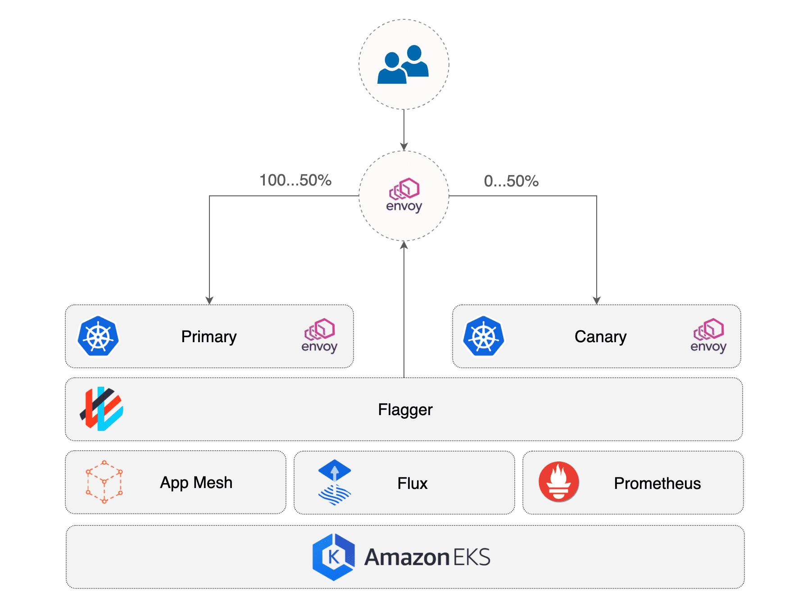

# Mastering GitOps in AWS

A workshop on how to implement EKS Progressive Delivery hands-on featuring 
[Flux][flux], [Flagger][flagger] and [AWS App Mesh][appmesh].

## Prerequistes

Install [eksctl][eksctl], [yq][yq], and the [Flux][flux] CLI.

On macOS,

```
brew install eksctl yq fluxcd/tap/flux
```

On Linux,

**eksctl**
```
# for ARM systems, set ARCH to: `arm64`, `armv6` or `armv7`
ARCH=amd64
PLATFORM=$(uname -s)_$ARCH

curl -sLO "https://github.com/weaveworks/eksctl/releases/latest/download/eksctl_$PLATFORM.tar.gz"

# (Optional) Verify checksum
curl -sL "https://github.com/weaveworks/eksctl/releases/latest/download/eksctl_checksums.txt" | grep $PLATFORM | sha256sum --check

tar -xzf eksctl_$PLATFORM.tar.gz -C /tmp && rm eksctl_$PLATFORM.tar.gz

sudo mv /tmp/eksctl /usr/local/bin
```

**yq**
```
wget https://github.com/mikefarah/yq/releases/latest/download/yq_linux_amd64 -O /usr/bin/yq &&\
    chmod +x /usr/bin/yq
```

**flux**
```
curl -s https://fluxcd.io/install.sh | sudo bash
```

In order to follow the guide you'll need a GitHub account and a personal access 
token that can create repositories (check all permissions under repo).

Fork this repository on your personal GitHub account and export your access 
token, username and repo:

```
export GITHUB_TOKEN=<your-token>
export GITHUB_USER=<your-username>
export GITHUB_REPO=mastering-aws-gitops
```

Clone the repository on your local machine:

```
git clone https://github.com/${GITHUB_USER}/${GITHUB_REPO}.git
cd ${GITHUB_REPO}
```

## Bootstrap the AWS EKS Cluster

Create a cluster with eksctl:

```
eksctl create cluster -f .eksctl/config.yaml
```

The above command with create a Kubernetes cluster v1.18 with two m5.large 
nodes in the us-west-2 region.

Verify that your EKS cluster satisfies the prerequisites with:

```
$ flux check --pre
► checking prerequisites
✔ Kubernetes 1.26.4-eks-0a21954 >=1.20.6-0
✔ prerequisites checks passed
```

Install Flux on your cluster with:

```
flux bootstrap github \
    --owner=${GITHUB_USER} \
    --repository=${GITHUB_REPO} \
    --branch=main \
    --personal \
    --path=clusters/appmesh
```

The bootstrap command commits the manifests for the Flux components in 
clusters/appmesh/flux-system dir and creates a deploy key with read-only 
access on GitHub, so it can pull changes inside the cluster.

Wait for the cluster reconciliation to finish:

```
$ watch flux get kustomizations 
```

## Application Bootstrap

To experiment with progressive delivery, we are going to use a small application 
called podinfo. This application is exposed outside the cluster with AppMesh 
Gateway. The communication between the gateway and application is managed by 
Flagger and AppMesh.

The application manifests are comprised of a Kubernetes deployment, a 
horizontal pod autoscaler, a gateway route (AppMesh custom resource) and 
release polices (Flagger custom resources).

```
./apps/podinfo/
├── abtest.yaml
├── canary.yaml
├── deployment.yaml
├── gateway-route.yaml
├── hpa.yaml
└── kustomization.yaml
```

Based on the release policy, Flagger configures the mesh and bootstraps the 
application inside the cluster.

Wait for Flagger to initialize the canary:

```
$ watch kubectl -n apps get canary
```

Find the AppMesh Gateway public address with:

```
export URL="http://$(kubectl -n appmesh-gateway get svc/appmesh-gateway -o jsonpath='{.status.loadBalancer.ingress[0].hostname}')"
echo $URL
```

Wait for the DNS to propagate and podinfo to become accessible:

```
$ watch curl -s ${URL}
{
  "hostname": "podinfo-primary-5cf44b9799-lgq79",
  "version": "5.0.0"
}
```

When the URL becomes available, open it in a browser and you'll see the 
podinfo UI.

## Automated Canary Promotion

When you deploy a new application version, Flagger gradually shifts traffic to 
the canary, and at the same time, measures the requests success rate as well as 
the average response duration. Based on an analysis of these App Mesh provided 
metrics, a canary deployment is either promoted or rolled back.



[flux]: https://fluxcd.io/
[flagger]: https://fluxcd.io/flagger/
[appmesh]: https://aws.amazon.com/app-mesh/
[eksctl]: https://eksctl.io/
[yq]: https://github.com/mikefarah/yq
